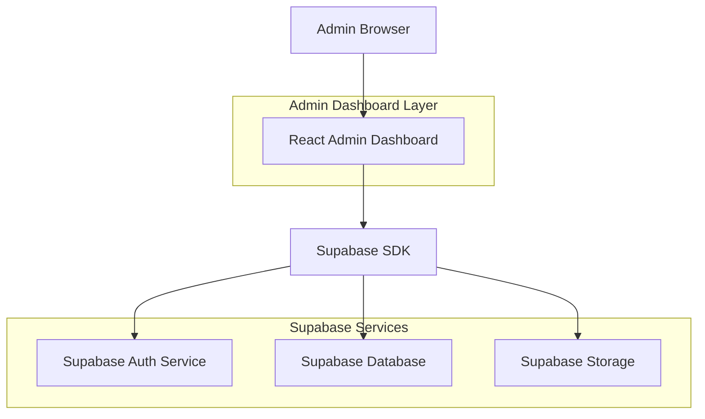
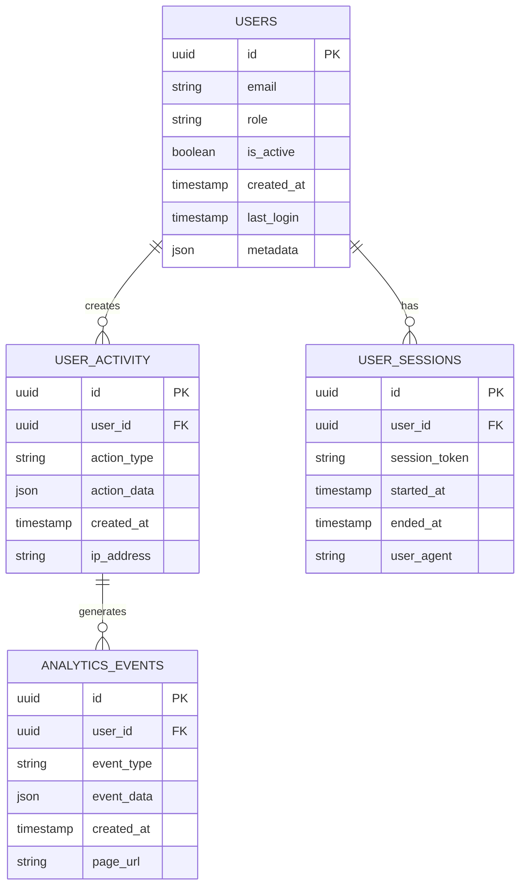

## 1. Architecture design



## 2. Technology Description
- Frontend: React@18 + tailwindcss@3 + vite
- Initialization Tool: vite-init
- Backend: Supabase (Backend-as-a-Service)
- Authentication: Supabase Auth with role-based access control
- Database: Supabase PostgreSQL
- Storage: Supabase Storage for file management

## 3. Route definitions
| Route | Purpose |
|-------|---------|
| /admin/login | Admin authentication page for semeradmin account |
| /admin/dashboard | Main dashboard with overview metrics and charts |
| /admin/users | User management interface with list and search |
| /admin/users/:id | Individual user details and management |
| /admin/settings | System configuration and settings |
| /admin/analytics | Analytics reports and data visualization |
| /admin/reports | Detailed reports with export functionality |

## 4. API definitions

### 4.1 Authentication API
```
POST /auth/v1/token
```

Request:
| Param Name| Param Type  | isRequired  | Description |
|-----------|-------------|-------------|-------------|
| email     | string      | true        | Admin email (semeradmin) |
| password  | string      | true        | Admin password |

Response:
| Param Name| Param Type  | Description |
|-----------|-------------|-------------|
| access_token | string   | JWT token for authentication |
| refresh_token | string  | Token for refreshing session |
| user      | object      | User data including role |

### 4.2 User Management API
```
GET /rest/v1/users
```

Query Parameters:
| Param Name| Param Type  | isRequired  | Description |
|-----------|-------------|-------------|-------------|
| select    | string      | false       | Fields to return |
| order     | string      | false       | Sort order |
| limit     | number      | false       | Number of results |
| offset    | number      | false       | Pagination offset |

### 4.3 Analytics API
```
GET /rest/v1/analytics
```

Query Parameters:
| Param Name| Param Type  | isRequired  | Description |
|-----------|-------------|-------------|-------------|
| start_date| string      | false       | Start date for analytics |
| end_date  | string      | false       | End date for analytics |
| metric    | string      | false       | Specific metric to retrieve |

## 5. Data model

### 5.1 Data model definition


### 5.2 Data Definition Language

Users Table (users)
```sql
-- create table
CREATE TABLE users (
    id UUID PRIMARY KEY DEFAULT gen_random_uuid(),
    email VARCHAR(255) UNIQUE NOT NULL,
    role VARCHAR(50) NOT NULL DEFAULT 'user' CHECK (role IN ('user', 'admin')),
    is_active BOOLEAN DEFAULT true,
    created_at TIMESTAMP WITH TIME ZONE DEFAULT NOW(),
    last_login TIMESTAMP WITH TIME ZONE,
    metadata JSONB DEFAULT '{}'
);

-- create indexes
CREATE INDEX idx_users_email ON users(email);
CREATE INDEX idx_users_role ON users(role);
CREATE INDEX idx_users_created_at ON users(created_at DESC);
CREATE INDEX idx_users_last_login ON users(last_login DESC);

-- grant permissions
GRANT SELECT ON users TO anon;
GRANT ALL PRIVILEGES ON users TO authenticated;
```

User Activity Table (user_activity)
```sql
-- create table
CREATE TABLE user_activity (
    id UUID PRIMARY KEY DEFAULT gen_random_uuid(),
    user_id UUID REFERENCES users(id) ON DELETE CASCADE,
    action_type VARCHAR(100) NOT NULL,
    action_data JSONB DEFAULT '{}',
    created_at TIMESTAMP WITH TIME ZONE DEFAULT NOW(),
    ip_address INET
);

-- create indexes
CREATE INDEX idx_user_activity_user_id ON user_activity(user_id);
CREATE INDEX idx_user_activity_created_at ON user_activity(created_at DESC);
CREATE INDEX idx_user_activity_action_type ON user_activity(action_type);

-- grant permissions
GRANT SELECT ON user_activity TO anon;
GRANT ALL PRIVILEGES ON user_activity TO authenticated;
```

Analytics Events Table (analytics_events)
```sql
-- create table
CREATE TABLE analytics_events (
    id UUID PRIMARY KEY DEFAULT gen_random_uuid(),
    user_id UUID REFERENCES users(id) ON DELETE CASCADE,
    event_type VARCHAR(100) NOT NULL,
    event_data JSONB DEFAULT '{}',
    created_at TIMESTAMP WITH TIME ZONE DEFAULT NOW(),
    page_url TEXT
);

-- create indexes
CREATE INDEX idx_analytics_events_user_id ON analytics_events(user_id);
CREATE INDEX idx_analytics_events_created_at ON analytics_events(created_at DESC);
CREATE INDEX idx_analytics_events_event_type ON analytics_events(event_type);

-- grant permissions
GRANT SELECT ON analytics_events TO anon;
GRANT ALL PRIVILEGES ON analytics_events TO authenticated;
```

### 5.3 Row Level Security Policies

Users Table RLS Policies:
```sql
-- Enable RLS
ALTER TABLE users ENABLE ROW LEVEL SECURITY;

-- Allow users to read their own data
CREATE POLICY "Users can view own profile" ON users
    FOR SELECT USING (auth.uid() = id);

-- Allow admin to read all users
CREATE POLICY "Admin can view all users" ON users
    FOR SELECT USING (EXISTS (
        SELECT 1 FROM users 
        WHERE id = auth.uid() AND role = 'admin'
    ));

-- Allow admin to update any user
CREATE POLICY "Admin can update any user" ON users
    FOR UPDATE USING (EXISTS (
        SELECT 1 FROM users 
        WHERE id = auth.uid() AND role = 'admin'
    ));
```

Analytics Events RLS Policies:
```sql
-- Enable RLS
ALTER TABLE analytics_events ENABLE ROW LEVEL SECURITY;

-- Allow admin to read all analytics
CREATE POLICY "Admin can view all analytics" ON analytics_events
    FOR SELECT USING (EXISTS (
        SELECT 1 FROM users 
        WHERE id = auth.uid() AND role = 'admin'
    ));
