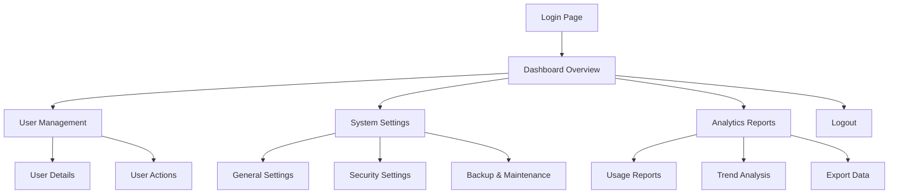

## 1. Product Overview
Admin dashboard for application management and usage analytics. Provides comprehensive data overview and management capabilities exclusively for the semeradmin account to monitor and control the application.

## 2. Core Features

### 2.1 User Roles
| Role | Registration Method | Core Permissions |
|------|---------------------|------------------|
| Admin | Fixed account (semeradmin) | Full access to all dashboard features, user management, system configuration, and analytics |

### 2.2 Feature Module
Our admin dashboard consists of the following main pages:
1. **Dashboard Overview**: Real-time metrics, usage statistics, and key performance indicators.
2. **User Management**: View, search, and manage all user accounts and their activities.
3. **System Settings**: Configure application parameters, manage features, and system maintenance.
4. **Analytics Reports**: Detailed usage reports, trend analysis, and export capabilities.

### 2.3 Page Details
| Page Name | Module Name | Feature description |
|-----------|-------------|---------------------|
| Dashboard Overview | Metrics Cards | Display total users, active sessions, API calls, and storage usage with real-time updates. |
| Dashboard Overview | Charts Section | Show user growth trends, usage patterns, and performance metrics with interactive charts. |
| Dashboard Overview | Recent Activity | List recent user activities, system events, and important notifications. |
| User Management | User List | Display paginated list of all users with search, filter, and sort capabilities. |
| User Management | User Details | View individual user profiles, activity history, and account status. |
| User Management | User Actions | Enable/disable accounts, reset passwords, and manage user permissions. |
| System Settings | General Settings | Configure application-wide parameters like rate limits, feature flags, and maintenance mode. |
| System Settings | Security Settings | Manage authentication settings, session timeouts, and security policies. |
| System Settings | Backup & Maintenance | Schedule backups, view system health, and perform maintenance tasks. |
| Analytics Reports | Usage Reports | Generate detailed reports on user activity, API usage, and resource consumption. |
| Analytics Reports | Trend Analysis | Analyze usage patterns over time with customizable date ranges. |
| Analytics Reports | Export Data | Export reports in various formats (CSV, PDF, JSON) for external analysis. |

## 3. Core Process
Admin Flow:
1. Admin logs in using semeradmin credentials
2. Lands on Dashboard Overview showing key metrics
3. Can navigate to User Management to oversee user accounts
4. Access System Settings to configure application parameters
5. Generate Analytics Reports for detailed insights
6. Logout when session complete

## 4. User Interface Design

### 4.1 Design Style
- **Primary Colors**: Deep blue (#1e40af) for headers, white (#ffffff) for backgrounds
- **Secondary Colors**: Light gray (#f3f4f6) for cards, green (#10b981) for success states, red (#ef4444) for errors
- **Button Style**: Rounded corners (8px radius), flat design with hover effects
- **Font**: Inter font family, 14px for body text, 16px for headers, 12px for small text
- **Layout Style**: Sidebar navigation with main content area, card-based components
- **Icons**: Material Design icons for consistency

### 4.2 Page Design Overview
| Page Name | Module Name | UI Elements |
|-----------|-------------|-------------|
| Dashboard Overview | Metrics Cards | Grid layout with 4 cards showing key metrics, each with icon, title, value, and percentage change indicator. |
| Dashboard Overview | Charts Section | Full-width cards with line charts and bar charts, interactive tooltips, legend, and time range selector. |
| Dashboard Overview | Recent Activity | Scrollable list with timestamp, user avatar, action description, and status indicators. |
| User Management | User List | Table with sortable columns, search bar, filter dropdowns, and pagination controls. |
| User Management | User Details | Modal or separate page with user info cards, activity timeline, and action buttons. |
| System Settings | Settings Panels | Grouped settings with toggle switches, input fields, and save/cancel buttons. |
| Analytics Reports | Report Generator | Date range picker, metric selection, chart preview, and export format options. |

### 4.3 Responsiveness
Desktop-first design approach with responsive breakpoints. Sidebar collapses to hamburger menu on mobile devices. Tables become horizontally scrollable on smaller screens. Charts maintain readability with responsive scaling.