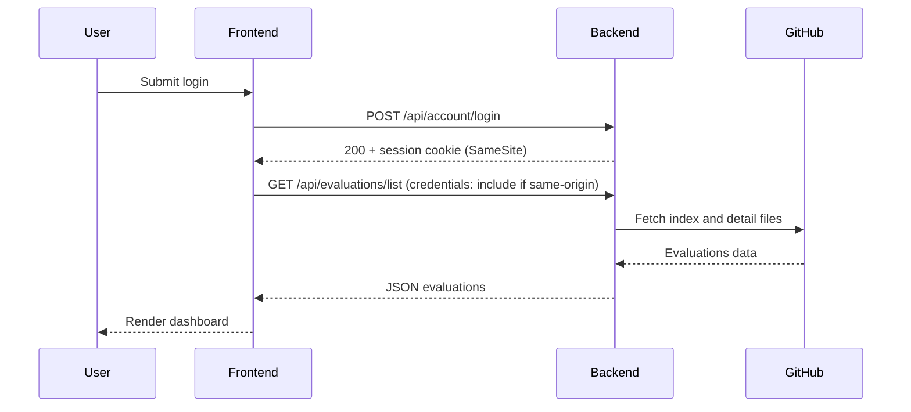

# Architecture Overview

This document captures the high-level architecture and key flows.

## System Diagram

```mermaid
flowchart LR
    UI[Frontend (Static: index.html)] -->|fetch| API[Backend (Express)]
    API -->|GitHub REST| GH[GitHub Data Repo]
    API -->|Workflows| MainRepo[Main Repo]
    subgraph Storage
        LS[localStorage]:::store
        IDB[IndexedDB]:::store
    end
    UI --> LS
    UI --> IDB

    classDef store fill:#eef,stroke:#66f,stroke-width:1px
```

## Sequence: Evaluation Load (Login)



## CORS & Cookies
- Backend CORS echoes allowed origin and sets `Access-Control-Allow-Credentials` when origin is allowed.
- In local HTTP cross-origin, browsers block cross-site cookies; UI informs users to use same origin or HTTPS.

